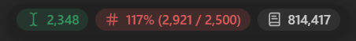
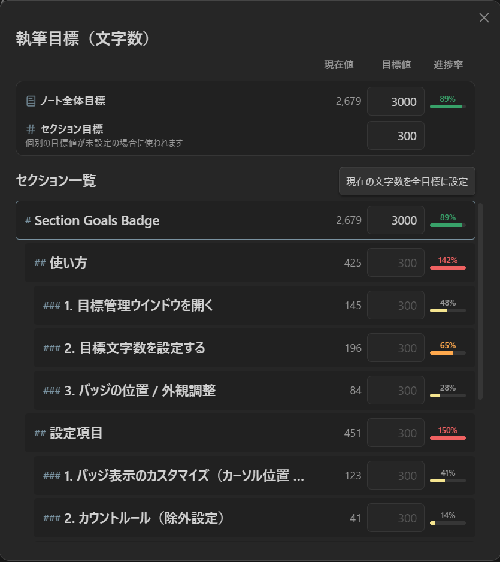

# Section Goals Badge

English | [日本語](README_ja.md)

[](https://obsidian.md/plugins?id=section-goals-badge)
[](https://github.com/k-quels/section-goals-badge/releases)
[](LICENSE)

A floating character counter and writing goal tracker per heading for Obsidian, designed for novel writers and long-form document creators.

Display floating badges on your editor to keep track of character counts and progress rates for the active heading (section) or entire note in real time.



---

## Key Features

- **Goal Tracking per Section (Heading)**: Set target character counts for each chapter or section.
- **Unobtrusive Floating Badge**: Position at any corner of the editor, with drag-and-drop movement and opacity adjustments.
- **3 Configurable Progress Badges**:
  - **Progress to Cursor**: Counts characters from note top (or section top) up to cursor position.
  - **Active Section Progress**: Counts characters within the current heading block.
  - **Note Total Progress**: Counts characters for the entire note.
- **Dynamic Badge Colors**: Visual status updates as you write.
  - Fully customizable colors via the Style Settings plugin.
- **Mobile-Friendly**: Works smoothly on smartphones even with massive documents.
- **Exclusion Rules**: Exclude whitespace, Japanese novel ruby notation, and custom user-specified symbols.
- **Fast & Battery Efficient (1M+ characters)**: Optimized to minimize typing latency and reduce mobile battery drain.
- **Self-Contained in Note**: Goal values are saved directly into the note's Frontmatter.

---

## Usage

### 1. Open Goal Management Window
- Tap or click the badge on the editor to open the goal management window.
  - *(Can be changed to "Long press to open" in settings to avoid accidental taps)*



### 2. Set Target Counts
Enter target counts directly in the modal (automatically saved to Frontmatter):
- **Note Total Goal**: Target count for the entire note.
- **Section Goal (Default)**: Default target applied to headings without individual goals.
- **Individual Section Goals**: Set specific targets per heading row in the list.
- **"Set current count as all goals" Button**: Batch-assigns written character counts as goals for all sections.

### 3. Adjust Badge Position & Appearance
- **Drag and drop** the badge to place it anywhere on your editor.
  - You can also specify exact offsets in the settings tab (synced with drag-and-drop values).

---

## Settings

The following features and options can be customized:

### 1. Badge Display Customization (Cursor / Section / Total)
- **Toggle Visibility**: Enable or disable the 3 progress badges independently.
- **Display Content**: Toggle current count, target goal, and progress percentage.
- **Icon / Label**: Toggle prefix icons and text labels.

### 2. Counting Rules (Exclusions)
- Exclude whitespace, Japanese novel ruby notation, and custom specified characters.

### 3. Appearance & Position
- Configure badge position preset, opacity, and font size.

### 4. Progress Color Thresholds
- Customize the percentage thresholds (default: 50% / 80% / 100%) that trigger dynamic badge color changes.
- *(Colors can be customized via the [Style Settings](https://github.com/mgmeyers/obsidian-style-settings) plugin)*

---

## Frontmatter Format

Target goals are stored in the note's YAML Frontmatter in the following format:

```yaml
---
goal-file: 10000    # Target count for the entire note
goal-section: 2000  # Default target count for sections
goals:
  - Chapter 1: 2500 # Target count for specific section
  - Chapter 2: 3000
---
```

If you want to clear all goals at once, simply delete these lines from the Frontmatter.

---

## Support & Donation

If you enjoy Section Goals Badge, your support is greatly appreciated!

[](https://buymeacoffee.com/quels)

---

## License

This software is released under the [MIT License](LICENSE).
