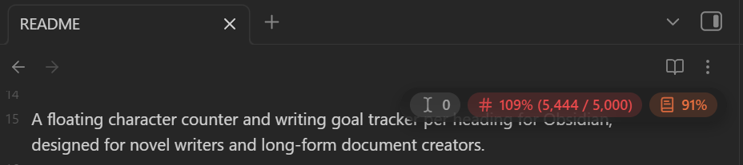
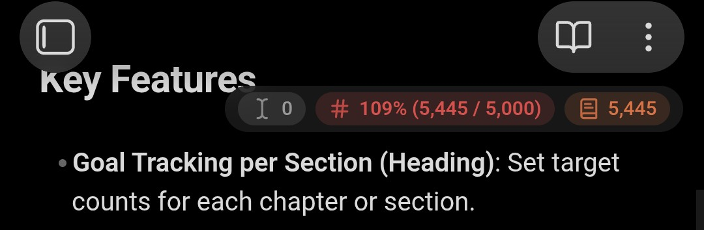
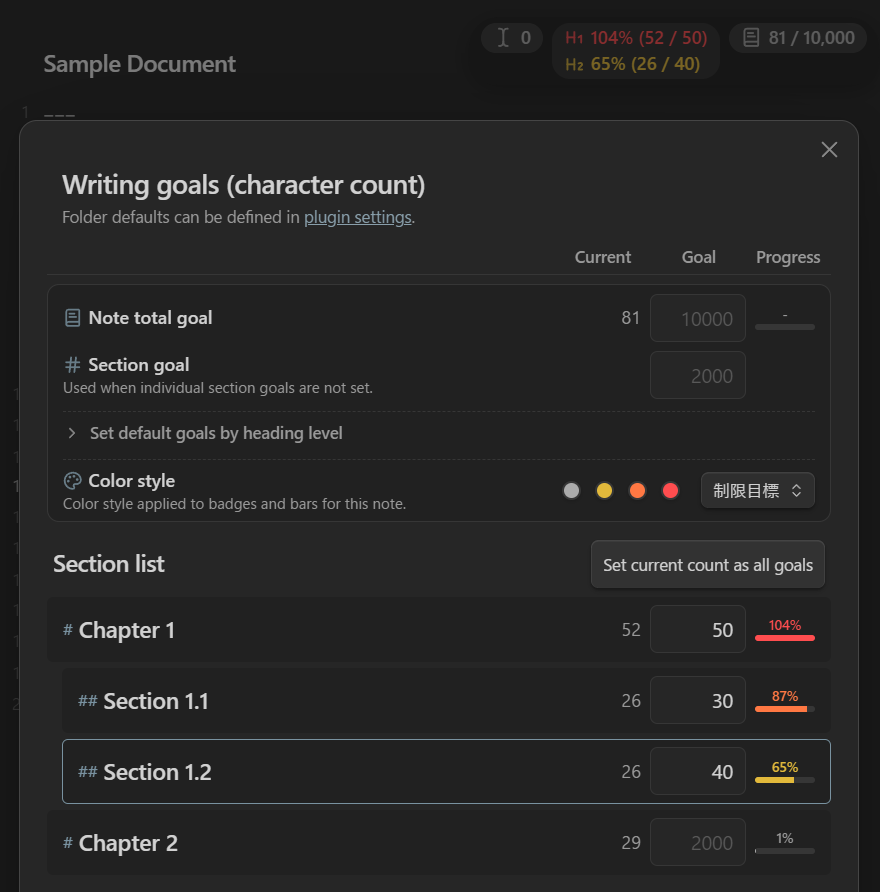
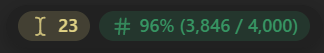
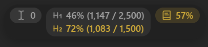
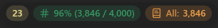
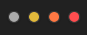
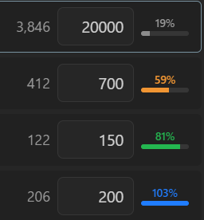

# Section Goals Badge

English | [日本語](README_ja.md)

[](https://obsidian.md/plugins?id=section-goals-badge)
[](https://github.com/k-quels/section-goals-badge/releases)
[](LICENSE)

A floating character counter and writing goal tracker per heading for Obsidian, designed for novel writers and long-form document creators.

Display floating badges on your editor to keep track of character counts and progress rates for the active heading (section) or entire note in real time.

▼ Desktop<br>


▼ Mobile<br>


---

## Key Features

- 🎯 **Goal Tracking per Section (Heading)**: Set target counts per folder, per note, or for each chapter and section.

- 📛 **Unobtrusive Floating Badge**: Position at any corner of the editor, with drag-and-drop movement and opacity adjustments.

- 🚥 **3 Configurable Progress Badges**:
  - **Progress to Cursor**: Counts characters from note top (or section top) up to cursor position.
  - **Active Section Progress**: Counts characters within the current heading block.
  - **Note Total Progress**: Counts characters for the entire note.

- 🎨 **Dynamic Badge Colors**: Define custom color styles and visually track progress rates at a glance.

- 📱 **Mobile-Friendly**: Works smoothly on smartphones even with massive documents.

- 🔢 **Character & Word Counting**: Switch between Character count and Word count freely.

- ✂️ **Exclusion Rules**: Exclude whitespace, Japanese novel ruby notation, and custom user-specified symbols.

- ⚡ **Fast & Battery Efficient (1M+ characters)**: Optimized to minimize typing latency and reduce mobile battery drain even in long-form writing.

---

## Usage

### 1. Open Goal Management Window

- Tap or click the badge on the editor to open the goal management window.<br>


  - Tips: Change to "Long press to open" in settings to avoid accidental taps.
  - Tips: Click a section name to close the modal and jump directly to that heading.

### 2. Set Target Counts

Enter target counts for each item (automatically saved to Frontmatter).<br>
*Note: To configure goals per folder, add folder definitions in the plugin settings.*

- **Note Total Goal**: Target count for the entire note being edited.
- **Section Goal**: Default target count applied to headings without individual goals.
- **Heading Level Goals**: Set default target counts for each heading level (H1–H6).
- **Individual Section Goals**: Enter specific target counts for each row in the heading list.

### 3. Adjust Badge Position & Appearance

- **Drag and drop** the badge to place it anywhere on your editor.
  - You can also specify exact values in the settings tab (synced with drag-and-drop values).

---

## Settings

The following features and options can be customized:

### 1. Badge Display Customization (Cursor / Section / Total)

- **Toggle Visibility**: Enable or disable the 3 progress badges independently.
  - ▼ e.g., Hide note total badge:<br>
  
- **Heading Level Progress (H1–H6)**: Display progress for specific heading levels (H1–H6) in the section progress badge.
  - ▼ e.g., When H1 and H2 are enabled, you can monitor H1 progress while editing H2:<br>
  
- **Display Content**: Toggle current count, target goal, and progress percentage.
  - ▼ e.g., Show only count for cursor position, full details for section:<br>
  
- **Icon / Label**: Toggle prefix icons and text labels.
  - ▼ e.g., Hide both for cursor, icon only for section, full for total:<br>
  

### 2. Counting Rules

- **Counting Method**: Switch between Character count and Word count.
- **Exclusion Settings**: Exclude whitespace, Japanese novel ruby notation, and custom specified characters.

### 3. Appearance & Position

- Configure badge position preset, opacity, and font size.

### 4. Color Styles

- In the plugin settings under **Color styles**, freely define and customize color schemes (up to 10 styles).
- Default Presets:
  - **① Limit Goal Style**: Best for strict word/character caps (Gray → Yellow → Orange → Red)<br>
  
  
  - **② Target Achievement Style**: Best for aiming to reach a target count (Gray → Orange → Green → Blue)<br>
  

- In the Goal Management modal, **select your preferred style per note** from the "Color style" dropdown.

- Progress color thresholds (default: 50% / 80% / 100%) can be customized in settings.

### 5. Folder-Level Defaults

- Set default target goals and color styles for notes under specified folders.
  - *Note: Settings specified within individual notes take precedence.*

---

## Frontmatter Format

- Target goals and color style choices are stored in the note's YAML Frontmatter in the following format.
- You can manage goals via the Goal Management modal or edit them directly.
- Setting goals is completely optional.

```yaml
---
goal-file: 10000       # <- Target count for the entire note
goal-section: 2000     # <- Default target count for sections
goal-section-h1: 3000  # <- Default target count for H1 (H1–H6 supported)
goal-style: 2          # <- Color style ID (omitted for default style)
goals:
  - Chapter 1: 2500    # <- Target count for specific section
  - Chapter 2: 3000
---
```

- **Tips**: If you want to clear all goals at once, simply delete these lines from the Frontmatter.

---

## Support & Donation

If you enjoy Section Goals Badge, your support is greatly appreciated!

[](https://buymeacoffee.com/quels)

---

## License

This software is released under the [MIT License](LICENSE).
